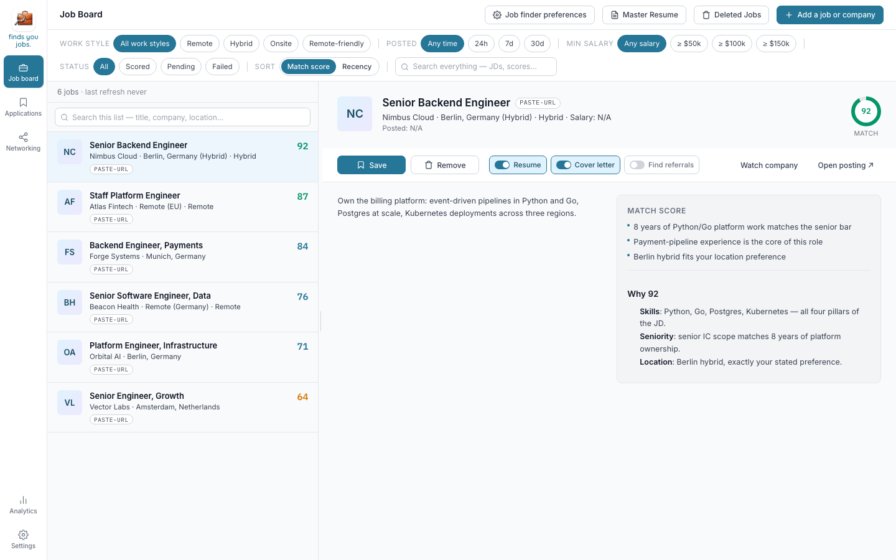
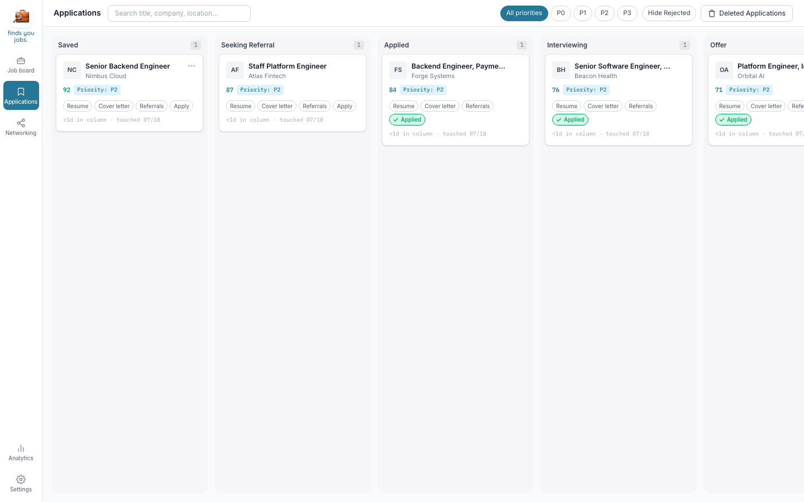
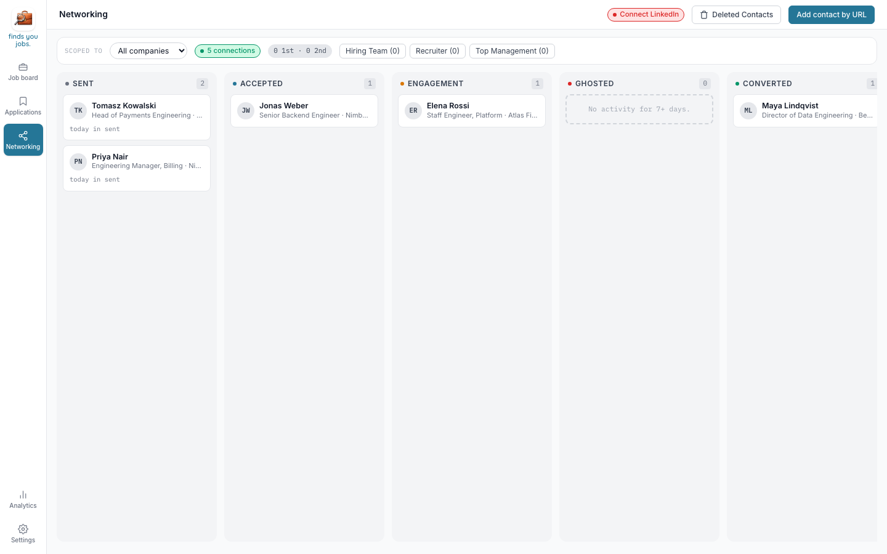

# finds-you-jobs

A free, open-source desktop app that takes the grunt work out of a job search — it
finds roles, scores them against your resume, tailors a resume and cover letter for
each, helps you ask for referrals, and fills application forms for you to review and
submit. Everything runs on **your** computer with **your** AI key; there is no
company server in the middle.

**Website: [findsyoujobs.com](https://findsyoujobs.com)**

## A quick tour

### Job Board — wake up to scored matches



finds-you-jobs scans hundreds of company career boards and job sources for you —
Greenhouse, Lever, Ashby, Workday and other ATS boards, remote-job boards, Hacker
News "Who is hiring", LinkedIn, and more — then scores every posting against your
resume and explains the score, so the roles worth your time sit at the top. Open a
role to read the posting, generate a tailored resume and cover letter for it, or
watch a company you care about so its new postings always show up.

### Applications — your whole pipeline on one board



Every role you save becomes a card that moves from Saved through Seeking Referral,
Applied, Interviewing, and Offer. A card carries its tailored resume, cover letter,
referral status, and a full activity history — so "where was I with this company?"
always has an answer. When you're ready to apply, the app fills the application form
and hands you the browser for the final review and Submit.

### Networking — referrals without the spreadsheet



A warm referral multiplies your odds of a callback, so finds-you-jobs treats it as a
first-class step: find the right people at a target company, draft a personalized
referral ask for each, and track every relationship from first contact to converted
referral. If you want, it can even send the connection requests and follow-ups for
you from your own LinkedIn account.★

★ Read the disclaimer in Settings before enabling LinkedIn automation.

## Install

Follow steps as per your OS:

---

### macOS

**Open a terminal:** press `⌘ + Space`, type `Terminal`, press Enter.

**Install** (one copy-paste — installs git and every dependency, and downloads the
app into a `finds-you-jobs` folder in your current directory):

```bash
curl -fsSL https://raw.githubusercontent.com/SrinivasRavi/finds-you-jobs/main/scripts/setup.sh | bash
```

If it asks you to install the "command line developer tools", click Install, wait,
then run the same command again.

**Start the app** (the script prints this exact line with your real path at the end;
if `pnpm` is "command not found", close Terminal, open a new one, and run it again):

```bash
cd finds-you-jobs && pnpm dev
```

**Everyday commands** (run inside the `finds-you-jobs` folder):

```bash
pnpm dev                                  # start the app
git pull && pnpm run boot                 # update to the latest version
FYJ_DATA_DIR="$HOME/fyj-test" pnpm dev    # start with a separate, fresh profile
```

---

### Windows

**Open a terminal:** press the `Windows` key, type `PowerShell`, press Enter.

**Install** (one copy-paste — installs git, the C++ build tools the desktop shell
needs, and every dependency, and downloads the app into a `finds-you-jobs` folder
in your current directory — or in your home folder if the current directory isn't
writable, e.g. an admin PowerShell that starts in `System32`; the build-tools
download is large, let it run):

```powershell
irm https://raw.githubusercontent.com/SrinivasRavi/finds-you-jobs/main/scripts/setup.ps1 | iex
```

**Start the app** (the script prints this with your real path at the end; if a
command is "not recognized", close PowerShell, open a new one, and try again):

```powershell
cd finds-you-jobs
pnpm dev
```

**Everyday commands** (run inside the `finds-you-jobs` folder — note PowerShell
uses `;` between commands, not `&&`):

```powershell
pnpm dev                                    # start the app
git pull; pnpm run boot                     # update to the latest version
$env:FYJ_DATA_DIR="$HOME\fyj-test"; pnpm dev  # start with a separate, fresh profile
```

---

### Linux

**Open a terminal:** press `Ctrl + Alt + T`, or open "Terminal" from your apps.

**Install** (one copy-paste — installs git, the desktop-shell system libraries via
your package manager (`sudo` will prompt), and every dependency, and downloads the
app into a `finds-you-jobs` folder in your current directory):

```bash
curl -fsSL https://raw.githubusercontent.com/SrinivasRavi/finds-you-jobs/main/scripts/setup.sh | bash
```

**Start the app** (the script prints this exact line with your real path at the end;
if `pnpm` is "command not found", close the terminal, open a new one, and run it again):

```bash
cd finds-you-jobs && pnpm dev
```

**Everyday commands** (run inside the `finds-you-jobs` folder):

```bash
pnpm dev                                  # start the app
git pull && pnpm run boot                 # update to the latest version
FYJ_DATA_DIR="$HOME/fyj-test" pnpm dev    # start with a separate, fresh profile
```

---

## First launch

The first `pnpm dev` compiles the desktop shell and can take a few minutes; later
launches are fast. The app then walks you through onboarding: paste your resume,
set your job preferences, pick an AI provider, and add your key.

## What it does

- A scored daily feed of jobs from 20 source families and 300+ preconfigured company boards (all public by default — no key needed; optional bring-your-own-key sources like Apify actors and Brave Search add more).
- AI-tailored resumes and cover letters per posting, which you review before you use them.
- A pipeline tracker: Saved → Seeking Referral → Applied → Interviewing → Offer → Rejected.
- Referral outreach: find people at a target company and message them from **your own** LinkedIn account (experimental, off by default — the account risk is yours).
- An in-app cost dashboard so you always know what you're spending on AI calls.

## Principles

- **Local-first, bring-your-own-key.** Your data and your AI key stay on your machine; there's no hosted backend. (A cloud AI provider you choose will, of course, see the requests you send it.)
- **You stay in control.** The app never submits an application on its own — it fills the form and hands you the open browser to review and click Submit yourself.
- **No AI slop.** Tailored output is grounded in your real resume and shown to you before it's used.
- **Open source.** [AGPL-3.0-only](LICENSE) — inspect it, fork it, improve it, share it back.

## For developers & contributors

- `pnpm test` · `pnpm lint` · `pnpm typecheck` — the gates.
- `pnpm dev:web` — run the sidecar + UI in a browser (no desktop window) for quick iteration.
- Third-party provenance: [THIRD_PARTY_NOTICES.md](THIRD_PARTY_NOTICES.md), [UPSTREAMS.md](UPSTREAMS.md). Release process: [RELEASING.md](RELEASING.md). Contributing (DCO sign-off required): [CONTRIBUTING.md](CONTRIBUTING.md).

## Discord
Join the discord for job search discussions and beta testing - https://discord.gg/hQRjKw6QS. If there is something that bothers you in the app, there is a limited time offer till July 25, 2026 to submit your thoughts and wishlist and get a chance to have your very own custom finds-you-jobs branch. For free of course!

Licensed [AGPL-3.0-only](LICENSE); carried upstream portions keep their own notices.
